<h1>Hi, I'm Anthony<h1>
  

  
  

### :technologist: About Me :

- 🔭 I’m currently working on a React Native application for iOS, Android and Web!

- ⚡ I am currently learning about CICD Pipelines, React Native, and Terraform

- 🎸 I love music and I enjoy playing the guitar

- 🔥 Fun fact: I founded an Entertainment company that specializes in fire dancing and fire performances which has been successfully running for 8 years

---

### :hammer_and_wrench: Languages and Tools :

   &nbsp;
    &nbsp;
  &nbsp;
  &nbsp;
  &nbsp;
  &nbsp;
   &nbsp;
   &nbsp;
  &nbsp;
  &nbsp;
   &nbsp;
  &nbsp;
  &nbsp;
  &nbsp;
    &nbsp;
  &nbsp;
  &nbsp;
  &nbsp;
  
  &nbsp;
   &nbsp;
    &nbsp;
    &nbsp;
   &nbsp;

---

 

 

 

 

---
